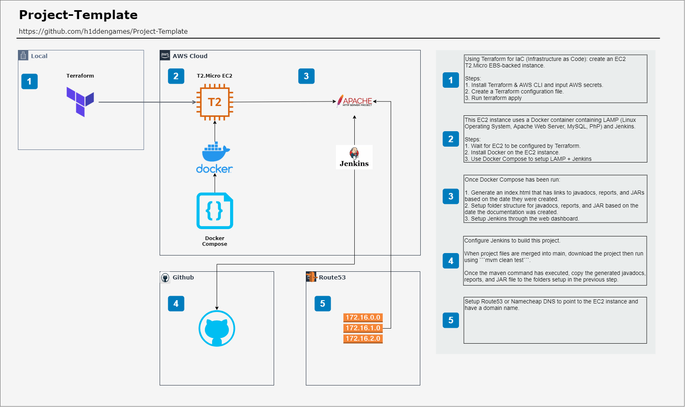

[](https://www.gnu.org/licenses/gpl-3.0)

# **Project-Template**

A Java 11 project template built to quick start new projects with minimal setup time.

- Please view the Javadocs [here.](http://www.hiddengames.site/project-template/javadocs "The javadocs for this project")
- Please view the Allure Reports [here.](http://www.hiddengames.site/project-template/reports "The reports for this project")
- Please view the JAR files [here.](http://www.hiddengames.site/project-template/reports "The jars for this project")
- Please view the README explaining how to set up a CI-CD pipeline [here](docs/markdown/Setting_up_CI-CD.md)


[A larger version of the above image can be found here](docs/infrastructure/infrastructure.html "To infrastructure.html")

The diagram above is in the [drawio file](docs/Project-Template-Infrastructure.drawio "To the drawio file") which can be opened using: [the draw.io app](https://app.diagrams.net/ "The draw.io app")

<br>

> ## **Important Notes**

<details>
    <summary>Click to expand/collapse</summary>

- **WINDOWS ONLY REQUIREMENT:** Git Bash is required to run the report generating scripts.
  - If your Git Bash was installed in a different location: update the pom.xml profiles/profile/id=windows/properties to point to your install location.

- Before pushing to this repository run the following commands: (update branchName with the actual branch name you wish to push to)
    ```bash
    mvn clean test
    git add . && git commit && git push origin branchName
    ```

- or combine the commands into one line :
  ```bash
  mvn clean test && \
  git add . && git commit && git push origin branchName
  ```

- Why are the above commands important?
    - ```mvn clean``` command copies all the history files from one allure report generation task to another.
      This allows you to see the trend tab on the home page, the history tab for all methods, and it fills all the graphs in the Graphs tab. 
    - ```mvn test``` command will build the project, run all test files, and allure will generate a report based off the new files in docs/allure-history directory
    - The ```git add . && git commit && git push origin branchName``` commands will add all tracked and untracked files to the git history, commit all changes, then push to a side branch.

- Once the above commands have been run: login to github in a browser, go to this project, then create a pull request.

- **Please note: both ```mvn clean``` and ```mvn test``` has been modified through the exec-maven-plugin in pom.xml to do the tasks above.**
- **Please note: If the reports are not displaying recent data, open the dev console in your browser and clear cache (local and session storage)**

</details>

<br>

> ## **Usage**

<details>
    <summary>Click to expand/collapse</summary>

This project should be stored in Intellij by clicking on Tools > Save Project as Template. Then when a new project will be created in Intellij, use this project template under New Project > User-defined.

This project can also be used by clicking on the "Use this template" button near the top of this page. This will create a github repository with the same folder structure and files found in this repository.

</details>

<br>

> ## **Dependencies**

<details>
    <summary>Click to expand/collapse</summary>

- JUnit 5 - Testing Framework
- Allure 2 - Reporting Framework
- Slf4j 12 - Logging Framework
- Selenium 3 - Browser Automation Framework
- WebDriverManager - Setup drivers for Selenium
- Rest-Assured - Rest API Framework
- Jackson-Databind - JSON Manipulation Framework
</details>

<br>

> ## **Project Setup**

<details>
    <summary>Click to expand/collapse</summary>

1. Download the project from this page by clicking on Code > Download ZIP or with the provided HTTPS or SSH options.
2. Open the project using an IDE such as Intellij or Eclipse.
3. Once the IDE has opened the project, run ```mvn clean test```
4. On first run, the IDE should install all required maven dependencies, if not: run ```mvn verify```.
5. Verify that the results show "Tests run: 6, Failures: 0, Errors: 0, Skipped: 0" and "BUILD SUCCESS"
6. Open pom.xml then update the group ID to your company domain in reverse domain name notation. (Example if your company domain is found at example.com then the reverse domain name notation would be com.example)
7. Update the artifactId to the name of the project you are currently working on.
8. Update the version according to your situation.
9. Update the versions of the libraries in the pom.xml file.
10. Add or remove libraries according to your needs.
11. If you are using a main class that is not entrypoint.App.java then update the pom.xml build/plugin section of the maven-assembly-plugin to the new main class. Then update the final name as required.
12. Update the test-workflow.yml based on your needs.
13. Add the allure folder .allure/allure-2.13.8 to your path in order to be able to call allure executable from anywhere.
14. In order to generate reports using allure, open a command prompt in the project's main folder. Then run ```allure serve target/allure-results/```
</details>

<br>

> ## **Optional Setup**

<details>
    <summary>Click to expand/collapse</summary>

- If you use multiple github accounts from the same computer:
1. Create a file named ```config``` in ```/.ssh```
2. Create an entry like the one below for every account you use

    ```bash
    Host github.com-firstAccountUserName
        HostName github.com
        User git
        IdentityFile ~/.ssh/id_for_first_user
        IdentitiesOnly yes
    
    Host github.com-secondAccountUserName
        HostName github.com
        User git
        IdentityFile ~/.ssh/id_for_second_user
        IdentitiesOnly yes
    ```

3. Open the ```projectFolder/.git/config``` file.
4. Update the line after ```[remote "origin"]``` to ```url = git@github.com-firstAccountUserName:firstAccountUserName/projectname.git```

- Please note: the usual URL is ```git@github.com:firstAccountUserName/projectname.git``` 
   but since you have multiple accounts on the same computer, you have to specify the identity file that git should use. 
- Notice how the ```github.com-username``` matches the ```/.ssh/config``` file Host format.
  
<br>

- If you want to host javadocs from the same repository as the java source files:
1. Create the docs folder ```projectMainFolder/docs```
2. Use the command line or Intellij to create javadocs. Search Everywhere > Generate JavaDoc > use default settings but specify projectMainFolder/docs as the output directory.
3. Open Github in a browser and go to the project repository.
4. Click on Settings and scroll down to GitHub Pages.
5. Enable GitHub Pages by selecting the main branch then click Save.
6. ```git add . && git commit && git push``` the newly created javadocs to your repository.
7. Access your javadocs on github pages by going to a link similar to ```https://h1ddengames.github.io/Project-Template```
ex: ```https://yourUserName.github.io/yourRepoName```
</details>

<br>

> ## **Build Setup**

<details>
    <summary>Click to expand/collapse</summary>

- maven-compiler-plugin: sets the java version.
- maven-surefire-plugin: runs junit tests and provides results to allure for reporting.
- maven-jar-plugin: suppresses generation of the default jar that is created during the package phase.
- exec-maven-plugin: generates a backup of allure history and report.
- maven-assembly-plugin: generates a jar with dependencies packed in (fat jar) with the name: ${project.artifactId}-${project.version}.jar (Example: Project-Template-1.0.0.jar)
- ~~.github/workflows/test-workflow.yml will:~~
    - ~~run on push to main branch, on pull request to main branch, and at 00:00 on Sunday.~~
    - ~~checkout your code to a ubuntu server running the latest version of ubuntu.~~
    - ~~setup JDK 11.0.9~~
    - ~~cache all required maven packages based on pom.xml~~
    - ~~build the project with maven using the following command~~ ```mvn -B clean test package --file pom.xml```
    - ~~copy the generated jar file to a directory called output~~
    - ~~generate allure results as json and html files.~~
    - ~~package the allure results with the jar file into a zip file called reports+jar that will be put in the artifacts section of the Actions tab on github under "Java CI".~~
- Github Actions has been commented out until further notice.
</details>

<br>
